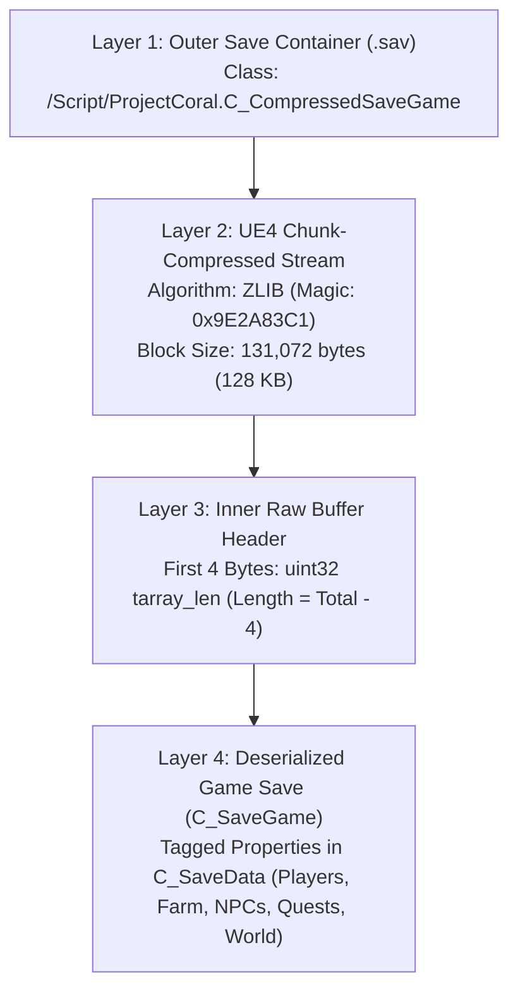

# Coral Island Save File Format Specification & Editor Guide

This document provides the complete reverse-engineered technical specification and implementation blueprint for **Coral Island** (`ProjectCoral`) save files. Use this guide to build automated save editors, multiplayer managers, world manipulators, and inventory/economy tools.

---

## 1. Overview & File System Layout

Coral Island is built on **Unreal Engine 4.27** (`++UE4+Release-4.27`) and uses a two-tier nested GVAS architecture with chunked ZLIB compression.

### Directory Structure
Save files are located in the user's Local AppData directory:
```
%LOCALAPPDATA%\ProjectCoral\Saved\SaveGames\
├── MultiplayerState.sav                    # Global multiplayer metadata (joined worlds, GUIDs)
├── World_0\                                # World slot 0
├── World_1\                                # World slot 1
├── ...
└── World_N\                                # Target World folder
    ├── Multiplayer.sav                     # Save marker (/Script/ProjectCoral.C_WorldMarkerSaveGame)
    ├── Singleplayer.sav                    # Present if world was created in singleplayer
    ├── EndOfDayAutoSave.sav                # Main active save file (overwritten daily)
    ├── MidDayAutoSave.sav                  # Mid-day checkpoint save (if enabled)
    ├── ManualSave0.sav                     # Manual backup slot
    └── Backups\
        ├── BackupSave0.sav
        ├── ...
        └── BackupSave9.sav                 # Rolling daily backups (up to 10 slots)
```

---

## 2. Save File Architecture (The 4-Layer Model)

Coral Island save files wrap an uncompressed UE4 save game inside a compressed wrapper object:



---

## 3. Detailed Binary Specifications

### Layer 1: Outer Save File (`C_CompressedSaveGame`)

The `.sav` file starts with a standard Unreal Engine GVAS header:

| Offset / Field | Type | Description |
| :--- | :--- | :--- |
| `0x00` | `char[4]` | GVAS Magic: ASCII `"GVAS"` (`0x47, 0x56, 0x41, 0x53`) |
| `0x04` | `uint32` | Save Game Version (e.g. `2`) |
| `0x08` | `uint32` | Package File Version (e.g. `522` / UE4.27) |
| `0x0C` | `uint16` | Engine Version Major (`4`) |
| `0x0E` | `uint16` | Engine Version Minor (`27`) |
| `0x10` | `uint16` | Engine Version Patch (`2`) |
| `0x12` | `uint32` | Engine Build (`0`) |
| `0x16` | `FString` | Engine Build ID (e.g. `"++UE4+Release-4.27\x00"`) |
| `+4` | `uint32` | Custom Versions Format (`3`) |
| `+4` | `uint32` | Custom Versions Count (e.g. `58`) |
| `+N` | `GuidVer[N]` | Array of 16-byte GUID + 4-byte `int32` version pairs |
| `+N` | `FString` | SaveGame Class Name: `"/Script/ProjectCoral.C_CompressedSaveGame\x00"` |
| `+N` | Tagged Properties | Property: `compressedSaveData` (`ArrayProperty` of `ByteProperty`) |
| Tail | Tagged Properties | `Version` (`IntProperty`, value `220`), `None\x00\x00\x00\x00` |

#### `compressedSaveData` Header Layout
```
[13 00 00 00] "compressedSaveData\x00"
[0E 00 00 00] "ArrayProperty\x00"
[uint64: p_size]              # Total Compressed Byte Stream Size + 4
[0D 00 00 00] "ByteProperty\x00"
[00]                          # Terminator byte
[uint32: array_length]        # Total Compressed Byte Stream Size
[Compressed Chunks Stream...]
```

---

### Layer 2: UE4 Chunked Compression Stream

Unreal Engine chunk-compresses archives using `FArchiveSaveCompressedProxy` and loads them with `FArchiveLoadCompressedProxy`.

- **Chunk Block Size:** Fixed `131,072` bytes (`0x20000` = 128 KB uncompressed).
- **Compression Library:** Standard Deflate / ZLIB (RFC 1950 header `0x78 0x9C`).
- **Sequential Header Format (48 bytes per chunk):**

```
 0                   1                   2                   3
 0 1 2 3 4 5 6 7 8 9 0 1 2 3 4 5 6 7 8 9 0 1 2 3 4 5 6 7 8 9 0 1
+-+-+-+-+-+-+-+-+-+-+-+-+-+-+-+-+-+-+-+-+-+-+-+-+-+-+-+-+-+-+-+-+
|               PACKAGE_FILE_TAG: 0x000000009E2A83C1            |
+-+-+-+-+-+-+-+-+-+-+-+-+-+-+-+-+-+-+-+-+-+-+-+-+-+-+-+-+-+-+-+-+
|               BlockSize (uint64): 0x0000000000020000 (131072) |
+-+-+-+-+-+-+-+-+-+-+-+-+-+-+-+-+-+-+-+-+-+-+-+-+-+-+-+-+-+-+-+-+
|               TotalCompressedSize (uint64): ChunkCompSize     |
+-+-+-+-+-+-+-+-+-+-+-+-+-+-+-+-+-+-+-+-+-+-+-+-+-+-+-+-+-+-+-+-+
|               TotalUncompressedSize (uint64): ChunkUncompSize |
+-+-+-+-+-+-+-+-+-+-+-+-+-+-+-+-+-+-+-+-+-+-+-+-+-+-+-+-+-+-+-+-+
|               ChunkCompressedSize (uint64): ChunkCompSize     |
+-+-+-+-+-+-+-+-+-+-+-+-+-+-+-+-+-+-+-+-+-+-+-+-+-+-+-+-+-+-+-+-+
|               ChunkUncompressedSize (uint64): ChunkUncompSize |
+-+-+-+-+-+-+-+-+-+-+-+-+-+-+-+-+-+-+-+-+-+-+-+-+-+-+-+-+-+-+-+-+
|               ZLIB Compressed Payload Data (CompSize bytes)...|
+-+-+-+-+-+-+-+-+-+-+-+-+-+-+-+-+-+-+-+-+-+-+-+-+-+-+-+-+-+-+-+-+
```

> [!NOTE]
> All chunks except the final one have `ChunkUncompressedSize = 131,072`. The final chunk has `ChunkUncompressedSize = TotalUncompressedSize % 131,072`.

---

### Layer 3: Inner Uncompressed Buffer Layout

When all ZLIB chunks are decompressed and concatenated, the resulting buffer layout is:

```
[Offset 0..3]: uint32 tarray_len  # CRITICAL: Must equal (len(buffer) - 4)
[Offset 4..7]: "GVAS"
[Offset 8..N]: Inner GVAS Header + Custom Versions Table
[Offset N.. ]: Class Name: "/Script/ProjectCoral.C_SaveGame\x00"
[Offset .. ]: saveData (StructProperty, type C_SaveData)
[Offset .. ]: Version (IntProperty, value 220)
[Offset .. ]: None\x00 (Root Terminator)
[Offset .. ]: 00 00 00 00 (Trailing 4-byte padding)
```

> [!CAUTION]
> **CRITICAL GOTCHA**: If you modify the uncompressed buffer size (e.g. adding/removing items or players), you **MUST** update the first 4 bytes (`tarray_len`). Failing to update this header causes UE4's `FArchiveLoadCompressedProxy` to read past EOF, triggering:
> `LowLevelFatalError: BulkData compressed header read error. This package may be corrupt!`

---

## 4. GVAS Tagged Property Type System

Inside `C_SaveData`, all game state is stored using Unreal Engine's Tagged Property serialization:

### FString Format
- `length > 0`: Positive 32-bit integer length (including null terminator), followed by UTF-8 bytes.
- `length < 0`: Negative 32-bit integer length, followed by `abs(length) * 2` bytes of UTF-16LE characters.
- `length == 0`: Empty string (no data bytes).

### Property Serialization Headers

| Property Type | Header Structure | Payload Layout |
| :--- | :--- | :--- |
| **`StructProperty`** | `FName(Name)` + `FName("StructProperty")` + `uint64(size)` + `FName(StructType)` + `GUID[16]` + `uint8(0)` | Member properties terminated by `FName("None")` |
| **`ArrayProperty`** | `FName(Name)` + `FName("ArrayProperty")` + `uint64(size)` + `FName(ElemType)` + `uint8(0)` | `uint32(count)` + elements |
| **`MapProperty`** | `FName(Name)` + `FName("MapProperty")` + `uint64(size)` + `FName(KeyType)` + `FName(ValType)` + `uint8(0)` | `uint32(num_keys_to_remove=0)` + `uint32(count)` + (Key, Value) pairs |
| **`SetProperty`** | `FName(Name)` + `FName("SetProperty")` + `uint64(size)` + `FName(ElemType)` + `uint8(0)` | `uint32(num_keys_to_remove=0)` + `uint32(count)` + elements |
| **`EnumProperty`** | `FName(Name)` + `FName("EnumProperty")` + `uint64(size)` + `FName(EnumType)` + `uint8(0)` | `FName(EnumValue)` |
| **`ByteProperty`** | `FName(Name)` + `FName("ByteProperty")` + `uint64(size)` + `FName(EnumType or "None")` + `uint8(0)` | 1 byte if None, or `FName(EnumValue)` |
| **`BoolProperty`** | `FName(Name)` + `FName("BoolProperty")` + `uint64(0)` + `uint8(val: 0 or 1)` + `uint8(0)` | *None (size is 0, stored in header)* |
| **`IntProperty`** | `FName(Name)` + `FName("IntProperty")` + `uint64(4)` + `uint8(0)` | `int32` (4 bytes little-endian) |
| **`Int64Property`** | `FName(Name)` + `FName("Int64Property")` + `uint64(8)` + `uint8(0)` | `int64` (8 bytes little-endian) |
| **`FloatProperty`** | `FName(Name)` + `FName("FloatProperty")` + `uint64(4)` + `uint8(0)` | `float32` (4 bytes IEEE 754) |
| **`StrProperty`** | `FName(Name)` + `FName("StrProperty")` + `uint64(size)` + `uint8(0)` | `FString` |
| **`NameProperty`** | `FName(Name)` + `FName("NameProperty")` + `uint64(size)` + `uint8(0)` | `FName` |

---

## 5. Major Game Systems & Save Keys in `C_SaveData`

Below is the directory of all primary game systems stored in `C_SaveData`:

### 1. Multiplayer & Configuration
- **`multiplayerConfig`** (`StructProperty`, `C_MultiplayerConfig`):
  - `Enabled` (`BoolProperty`): World multiplayer flag.
  - `worldId` (`StructProperty`, `Guid`): Unique network session GUID.
  - `gameConfig` (`C_MultiplayerGameConfig`): `money` (`EC_MoneyStyle::SHARED` or `EC_MoneyStyle::SEPARATE`).
  - `serverConfig` (`C_MultiplayerServerConfig`): `decorMode` (`EC_DecorModeType::EVERYONE` / `HOST_ONLY`).
- **`playerCharacterIdRunningTally`** (`IntProperty`): High-water mark of character IDs created in this world.

### 2. Time & Calendar
- **`currentDate`** (`C_TimeDate`): Day, Season (`Spring`, `Summer`, `Fall`, `Winter`), Year.
- **`clockWork`** (`FloatProperty`): Current in-game clock time (seconds from 6:00 AM).
- **`totalPlayTime`** (`FloatProperty`): Total world playtime in seconds.
- **`currentWeather`** / **`weatherForecast`** (`EnumProperty`, `EC_Weather`): `Sunny`, `Rain`, `Storm`, `Snow`, `Windy`, `Blizzard`.

### 3. Players (`players` `ArrayProperty` of `C_PlayerSaveData`)
Each element in `players` contains the complete state for one player:
- **`playerInfo`** (`C_PlayerInformation`):
  - `Name`, `SanitizedName` (`StrProperty`)
  - `farmName`, `sanitizedFarmName` (`StrProperty`)
  - `gender` (`EC_Gender::Male` / `EC_Gender::Female` / `EC_Gender::NonBinary`)
  - `CustomGenderText` (`StrProperty`)
  - `playerAppearance` (`C_CharCuzStruct`): Hair ID, skin color RGB, body type, outfit IDs.
- **`lastKnownPlayerAccountName`** (`StrProperty`): Steam username (or empty for local host).
- **`lastKnownPlayerPlatform`** (`EPlayerOnlinePlatform`): `Steam`, `Xbox`, `PlayStation`, `Unknown`.
- **`playerHouseIndex`** (`IntProperty`): House index (`0` = Main farmhouse, `1..3` = Co-op cabins).
- **`playerStatistics`** (`MapProperty<EnumProperty, StructProperty>`): Health, Stamina max/current, stamina usage.
- **`activeBuffs`** (`ArrayProperty` of `C_PlayerBuffSaveEntry`): Consumable food buffs, potion buffs.
- **`mapRevealData`** (`C_MapRevealSaveData`): Unlocked map fog coordinates and discovered POIs.
- **`farmHouse`** (`C_FarmHouseSaveData`): Farmhouse tier/upgrade level, style variations.
- **`interiorSaveData`** (`C_FarmHouseInteriorSaveData`): Placed furniture, wallpaper, flooring, and room items inside the player's house.
- **`underwaterFarmHouseInterior`**: Merfolk underwater house interior data.
- **Inventory & Containers**: `savedItemSlotList`, `usableSlotQueue`, `C_InventorySlotData` (Item IDs, stack counts, quality levels: Normal, Bronze, Silver, Gold, Osmium).

### 4. Farm & World Grid
- **`farmBuildingSaveDataMap`** (`MapProperty`): Placed barns, coops, silos, sheds, co-op cabins (`item_110023`), and greenhouses.
- **`placedSaveDataMap`** / **`gridObjectsDataMap`**: Placed machines (Artisan equipment, Kegs, Mason Jars, Chests, Scarecrows, Sprinklers, Furnaces).
- **`tileSaveDataMap`** & **`farmTileSaveDataMap`**: Farm soil states (tilled, watered, fertilized).
- **`cropSaveDataMap`**: Placed crops, growth stage, days watered, regrow counts.
- **`debrisSaveDataMap`**: Rocks, logs, trash, and weeds on the farm and town.
- **`treeSaveDataMap`** / **`fruitTreeSaveDataMap`**: Wild and planted trees, wood levels, tapped status.

### 5. Progression, NPCs & Town
- **`NPCSaveData`** (`MapProperty`): Friendship heart points, daily talk status, gift count, marriage state.
- **`townRankData`** (`C_TownRankSaveData`): Heritage points, Ocean cleaning points, Museum points, Town Rank letter (E, D, C, B, A, S).
- **`museumCollectionRewardStates`** & **`donatedItemInfo`**: Donated bugs, fish, ocean critters, gems, artifacts, and fossils.
- **`offeringGroupsMap`**: Goddess Altar Lake Temple offerings and completed bundles.
- **`divingLevelData`**: Cleaned ocean areas, activated solar orbs, Merfolk kingdom access.
- **`mineProgressionMap`**: Earth, Water, Wind, and Fire shaft elevators unlocked.

---

## 6. Complete Python Reference Implementation (SDK)

Here is a self-contained, production-tested Python class to decompress, inspect, modify, and repack Coral Island save files:

```python
"""
Coral Island Save Engine (UE4.27 GVAS Chunked ZLIB)
Compatible with Python 3.10+
"""

import struct
import zlib
import os
from typing import Tuple, List, Dict, Any, Optional

PACKAGE_MAGIC = 0x9E2A83C1
CHUNK_BLOCK_SIZE = 131072  # 128 KB


class CoralSaveEngine:
    @staticmethod
    def read_fstring(buf: bytes, pos: int) -> Tuple[Optional[str], int]:
        """Reads a UE4 length-prefixed FString (UTF-8 or UTF-16LE)."""
        if pos + 4 > len(buf):
            return None, pos
        length = int.from_bytes(buf[pos:pos+4], 'little', signed=True)
        pos += 4
        if length == 0:
            return '', pos
        elif length > 0:
            s = buf[pos:pos+length-1].decode('utf-8', errors='replace')
            return s, pos + length
        else:
            u_len = -length * 2
            s = buf[pos:pos+u_len-2].decode('utf-16le', errors='replace')
            return s, pos + u_len

    @classmethod
    def decompress_sav(cls, file_path: str) -> Tuple[bytes, bytearray, bytes]:
        """
        Decompresses a Coral Island .sav file.
        Returns: (outer_header_prefix, uncompressed_payload, outer_trailing_data)
        """
        with open(file_path, 'rb') as f:
            data = f.read()

        pos = data.find(b'\xc1\x83*\x9e\x00\x00\x00\x00')
        if pos == -1:
            raise ValueError("Invalid Coral Island save: Compression magic 0x9E2A83C1 not found.")

        header_prefix = data[:pos]
        decompressed = bytearray()
        cur = pos

        while cur < len(data):
            if cur + 48 > len(data):
                break
            magic, block_size, total_csize, total_usize, chunk_csize, chunk_usize = struct.unpack('<6Q', data[cur:cur+48])
            if magic != PACKAGE_MAGIC:
                break
            chunk_data = data[cur+48 : cur+48+chunk_csize]
            decomp = zlib.decompress(chunk_data)
            decompressed.extend(decomp)
            cur += 48 + chunk_csize

        trailing_data = data[cur:]
        return header_prefix, decompressed, trailing_data

    @classmethod
    def compress_payload(cls, decompressed_data: bytes, block_size: int = CHUNK_BLOCK_SIZE) -> bytes:
        """Compresses uncompressed payload into sequential UE4 chunk packages."""
        compressed_stream = bytearray()
        total_len = len(decompressed_data)

        for i in range(0, total_len, block_size):
            block = decompressed_data[i:i+block_size]
            c_block = zlib.compress(block)
            c_size = len(c_block)
            u_size = len(block)
            header = struct.pack('<6Q', PACKAGE_MAGIC, block_size, c_size, u_size, c_size, u_size)
            compressed_stream.extend(header)
            compressed_stream.extend(c_block)

        return bytes(compressed_stream)

    @classmethod
    def repack_sav(cls, header_prefix: bytes, modified_uncompressed: bytes, trailing_data: bytes, output_path: str) -> None:
        """
        Repacks modified uncompressed payload into a valid .sav file.
        Synchronizes the outer ArrayProperty and inner TArray length headers.
        """
        # 1. Update inner TArray length at byte 0
        new_tarray_len = len(modified_uncompressed) - 4
        payload = bytearray(modified_uncompressed)
        payload[0:4] = struct.pack('<I', new_tarray_len)

        # 2. Compress payload
        new_compressed_stream = cls.compress_payload(bytes(payload))

        # 3. Update outer ArrayProperty headers
        pos = header_prefix.find(b'compressedSaveData\x00') - 4
        _, pos = cls.read_fstring(header_prefix, pos)
        _, pos = cls.read_fstring(header_prefix, pos)
        p_size_offset = pos
        pos += 8
        _, pos = cls.read_fstring(header_prefix, pos)
        pos += 1  # term
        array_len_offset = pos

        new_header = bytearray(header_prefix)
        new_header[p_size_offset:p_size_offset+8] = struct.pack('<Q', len(new_compressed_stream) + 4)
        new_header[array_len_offset:array_len_offset+4] = struct.pack('<I', len(new_compressed_stream))

        # 4. Write output file
        with open(output_path, 'wb') as f:
            f.write(new_header)
            f.write(new_compressed_stream)
            f.write(trailing_data)
```

---

## 7. Step-by-Step Guide: Implementing Custom Save Modifications

When building features (e.g. item spawner, money editor, skill booster, multiplayer manager), follow this checklist:

### Workflow for Slicing / Editing Save Data
1. **Decompress**: Call `CoralSaveEngine.decompress_sav(filepath)` to obtain the uncompressed byte stream.
2. **Locate Target Property**: Find your target field (e.g. `money`, `players`, `itemSpecialUnlockIDs`) using `pos = data.find(b'propertyName\x00') - 4`.
3. **Parse Property Header**:
   - Read `PropertyName` (`FString`)
   - Read `PropertyType` (`FString`)
   - Read `PropertySize` (`uint64`)
   - Read type-specific metadata (`StructType` + GUID + terminator for Structs, `ElemType` + terminator for Arrays, etc.).
4. **Modify Value / Slices**:
   - If changing fixed-size fields (e.g. `IntProperty`, `FloatProperty`, `EnumProperty` of same string length), overwrite in-place.
   - If inserting/deleting elements or changing string lengths:
     - Splicing `new_data = data[:start] + replacement + data[end:]`
     - Calculate length difference `delta = len(replacement) - (end - start)`.
     - Update property `size` field (`PropertySize += delta`).
     - Update parent container `size` fields (e.g. `s_size` in `players`, and `saveData` StructProperty `size`).
5. **Repack**:
   - Call `CoralSaveEngine.repack_sav(header_prefix, new_data, trailing_data, output_path)`.
6. **Verify**:
   - Automatically decompress the written `.sav` file and assert that the uncompressed size and GVAS roots parse cleanly.

---

## 8. Summary Checklist for Tool Developers

- [x] **Always backup** before modifying any `.sav` file.
- [x] **Match chunk block sizes** to 131,072 bytes (128 KB).
- [x] **Update all 4 header lengths**:
  1. Inner property `uint64` size
  2. Outer `C_SaveData` `uint64` size
  3. Inner buffer `tarray_len` (`uint32` at byte offset 0)
  4. Outer `compressedSaveData` `ArrayProperty` `uint64` size and `uint32` length
- [x] **Preserve custom version tables** (58 GUID entries) in both outer and inner GVAS headers.
- [x] **Support UTF-16LE strings** for non-ASCII player/farm names (indicated by negative string lengths).
